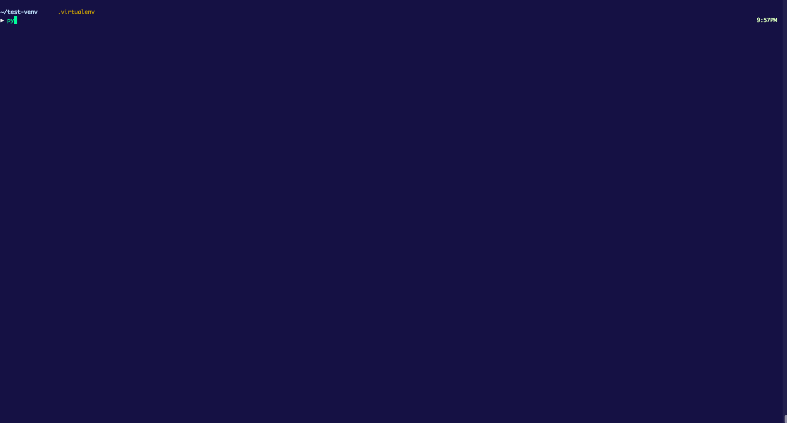

## Usage

This application assumes the user has an active AWS account with credential profiles located in `~/.aws/credentials`. While this application uses the Boto3 library to perform AWS actions, it is assumed the user has the AWS CLI installed locally.

Ensure that AWS Credential file exists at `~/.aws/credentials` and contains at least one profile. `awscui` supports credential files containing multiple profiles.

To start, navigate to any working directory (for example, a Terraform directory associtated with a specific AWS profile), and run the application:
```
pyaws
```

### Demo

<div align="center">
    
</div>

<br>

When starting the application in any directory for the first time, the Account Selection screen will be shown. This provides the user with the ability to select which profile to access.

Upon selection of a profile, the Console Selection screen is shown providing the user with a list of possible consoles to view, as well as a Region selection list. _By default, first region selected is `us-east-1`._

Current Profile and Region selection is saved to `$PWD/.pyaws/metadata.json` upon exit. Whenever the application is loaded again in the same directory, the previously selected Profile and Region are used by default and the Console Select screen will be displayed.

### Helper Args

- `-h` - Show help menu.
- `-d` - Debug mode. Prints logs to `.pyaws/`.
- `-n` - Do not save metadata changes on exit (region, profile, logging).
- `-p` - Set the Default Profile on start.
- `-r` - Set the Default Region on start.